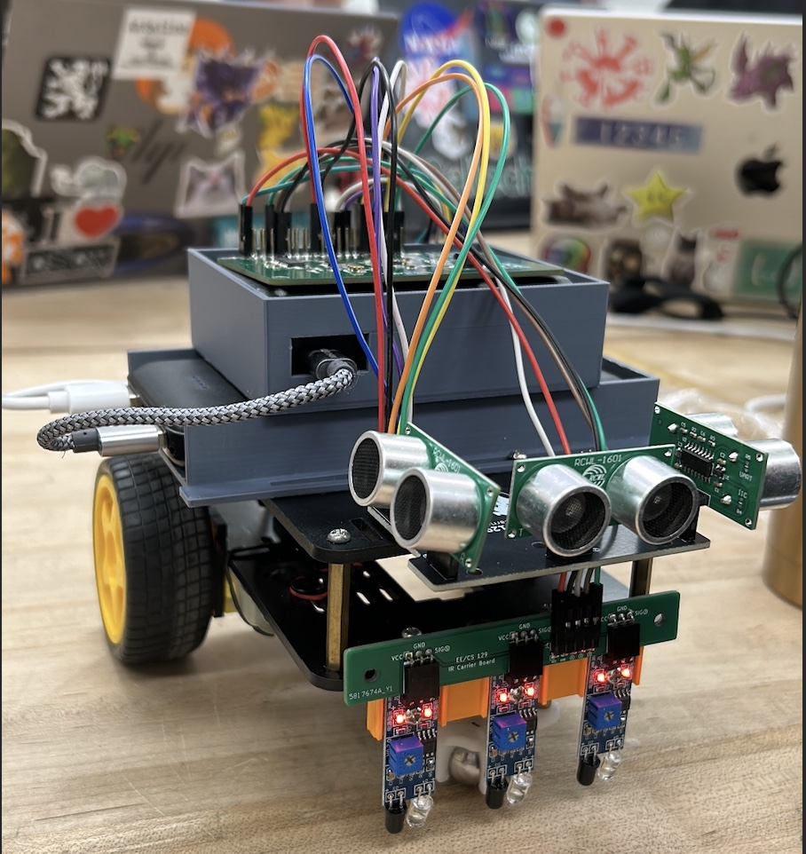

# 🧭 Prize-Fetching Autonomous Robot  
**Final Project — ME/CS/EE 129: Spring 2024-25**

## Overview
This project showcases an autonomous mobile robot capable of exploring a grid-based environment, detecting prizes using onboard sensors, planning the shortest paths, and successfully fetching and returning prizes using a magnet-based pickup system. The robot operates in a dynamic multi-agent environment, using multithreading and ROS2 messaging to navigate, plan, and act concurrently.

## Game Concept
In the final demonstration, 10 autonomous robots compete to collect magnetic prizes scattered across a structured map. The game includes two modes:
- **Assigned Goal Mode:** Fetch a specific prize identified by a ROS2 command.
- **Free For All Mode:** Maximize score within 5 minutes by collecting any accessible prizes.

The robot:
- Starts from a designated *home* dead-end.
- Scans *NFC tags* at intersections to retrieve dynamic prize information.
- Locates *101-pattern markers* on streets that indicate prize locations.
- Picks up prizes using a rear-mounted *electromagnet*.
- Returns to the home location to drop them off and score.

## Map & Navigation
The robot explores a regular grid of intersections and streets:
- **Intersections** contain embedded *NFC tags* with encoded prize data.
- **Dead-ends** serve as home bases and drop-off zones.
- **101 Tape Markers** in mid-street locations mark prize pickup points.

The map is unknown at the beginning of each round. The robot builds an internal map using sensor data and updates it with every intersection visit. Dijkstra’s algorithm is used for shortest-path planning.

## Features & Behaviors
- **Autonomous Exploration:** Scans unexplored intersections, detects dead-ends, and avoids loops.
- **Prize Localization:** Narrows down prize locations by comparing NFC-based distance data.
- **Path Planning:** Implements Dijkstra’s algorithm to select optimal routes.
- **Obstacle Avoidance:** Avoids other bots using proximity sensors.
- **Pickup Maneuver:** Executes a compound backup-turn-forward sequence to activate the electromagnet precisely over the prize.
- **Dropoff Protocol:** Navigates to the home dead-end, turns around, and safely drops the prize.

## Hardware Components
- Line-following IR sensor array
- Magnetometer (for heading detection)
- NFC tag reader (for prize location data)
- Electromagnet (to retrieve magnetic prizes)
- Proximity sensor (for bot collision avoidance)
- Motor driver + encoders
- Raspberry Pi or embedded controller running Python with ROS2


*Figure 1: Final version of the autonomous prize-fetching robot.*

## Software Architecture
### Threaded System (Multithreaded Design)
- **Brain Thread:** Core decision-making logic. Handles mode switching, planning, exploration, and goal execution.
- **Sensor Thread:** Reads magnetometer, IR, and proximity data.
- **UI Thread:** Interfaces with keyboard or command-line inputs for manual or debug control.
- **ROS Thread:** Subscribes to NFC data, prize assignments, and sends/receives ROS2 messages.

### Key Modules:
- `main.py`: Initializes all threads and coordinates shared state.
- `brain.py`: Contains exploration logic, goal seeking, and behavior coordination.
- `map.py`: Tracks known intersections, street statuses, and computes paths.
- `behaviors.py`: Implements line-following, turning, prize pickup, and dropoff.
- `ros.py`: Handles communication with ROS2 and data decoding.

## ROS2 Communication
At the beginning of each game, the bot receives:
- A dictionary mapping each *NFC ID* to distances of all prizes.
- A dictionary mapping each *Prize ID* to its *value* and *pickup heading*.
- An optional *assigned prize ID* (for goal mode).

These are received via ROS2 and stored in shared variables used throughout the system.

Example:
```python
nfc_data = {
  "N1": {"P1": {"distance": 3.5}, "P2": {"distance": 2.5}}
}
prize_info = {
  "P1": {"value": 10, "heading": 3},
  "P2": {"value": 5, "heading": 1}
}
```

## Prize Pickup Routine
The robot:
1. Detects 101 marker with IR sensors.
2. Aligns to the correct side based on prize heading.
3. Backs up to position magnet above the prize.
4. Activates electromagnet and retrieves prize.
5. Returns to normal driving.

Pickup logic is encapsulated in `line_follow_to_prize()` inside `behaviors.py`.

## Prize Dropoff Routine
At home:
1. Drives to end of home dead-end.
2. Performs a 180° turn.
3. Stops and turns off electromagnet.
4. Human team member removes prize.

## Setup & Run
# Clone and install dependencies
git clone https://github.com/yourusername/prize-fetching-robot.git
cd prize-fetching-robot
pip install -r requirements.txt

# Run main control loop
python3 main.py

